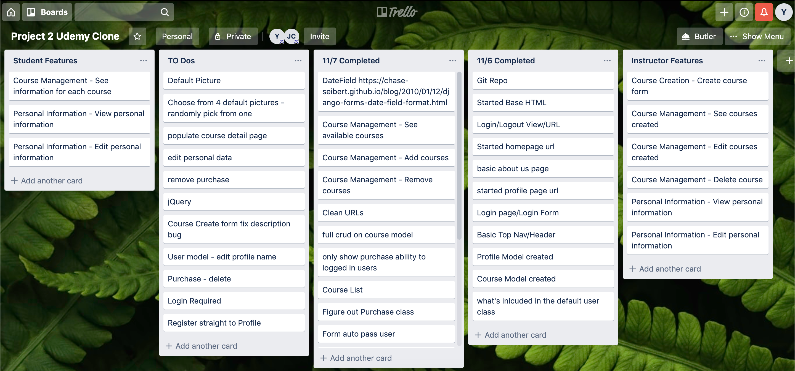
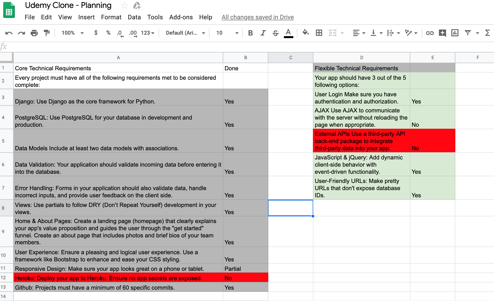
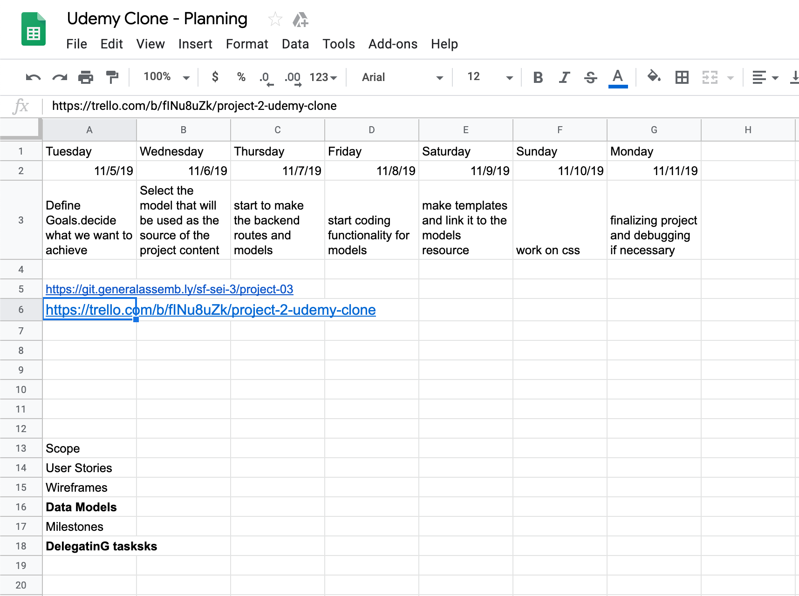

# Project 2 - academy-revolutionary-confederation (ARC)

## Contents

* **[Overview](#overview):** What is this ARC(Academy-Revolution-Confederation)?
* **[Planning & Deliverables](#planning--deliverables):** What will we be turning in?
* **[Technical Requirements](#technical-requirements):** What technologies will we be using?

---

## Overview

###### What is this ARC(Academy-Revolution-Confederation)?

We are the here to help students get with simple and manageable courses/lessons. By looking through our course list and making quick purchases. You will have access to all the course's and contents to get you to where you want to go.

**Our Wire Frames:**


  

  

 

---

## Planning & Deliverables

### Project Planning Deliverables

All planning deliverables found here: 
https://drive.google.com/drive/folders/1pPdeoyCLvcZ67a7ETXVOLxhGiPTnzhe6
https://trello.com/b/fINu8uZk/arc-project-2
* Scope Document / Team Member Delegation
* User Stories
* Project Plan / Proposed Schedule / Models

  

### Project Details
#### Requirements
* Django
* PostgreSQL
* Data Validation
  * Registration Form
  * Login Form
  * Login Required
  * Course Edit
 * Error Handling
  * Via Django forms & error messages on page
 * Animate.css for animations
 * User Login w/ authentication & authorization
 * JavaScript + JQuery
   * Event Listeners for animations
 * User-Friendly URLs
 
#### Wishlist
* Instructor Model
* Expanded Course Details
* Extended User Class
* Edit User info
* Register success > Logged in state


#### Contributors
* Kenny K - https://git.generalassemb.ly/KennyK-TW
* Pouyesh S - https://git.generalassemb.ly/pouyesh
* Felipe C - https://git.generalassemb.ly/FelipeCosta
* Jeff C - https://git.generalassemb.ly/jeff-chan-sf-sei-05

### Project Wins & Challenges
#### Wins
Purchase Object Creation:
```
@login_required
def purchase_create(request, course_slug):
  course = Course.objects.get(slug=course_slug)
  purchase = Purchase(student=request.user, course=course)
  purchase.save()
  return redirect ('profile')
```

The Power of Join Tables
```
def course_detail(request, course_slug):
    course = Course.objects.get(slug=course_slug)
    course_pk = course.pk
    purchases = Purchase.objects.filter(course = course_pk)
    context = {"course": course, "purchases": purchases}
    return render(request, "course_detail.html", context)
```

Django Form Semi-customization:
```
   <form method="POST" class="col-md-6 order-md-1">
            
      <div class="mb-3">
        <label for="id_title" class="course-form-label">Course Title</label>
        <div>
          {{form.title}}
        </div>
      </div>
      <div class="mb-3"> 
        <label for="id_category" class="course-form-label">Course Category</label>
        <div>
          {{form.category}}
        </div>
      </div>
      <div class="mb-3">
        <label for="id_start_date" class="course-form-label">Start Date</label>
        <div>
          {{form.start_date}}
        </div>
      </div>
      <div class="mb-3"> 
        <label for="id_end_date" class="course-form-label">End Date</label>
        <div>
          {{form.end_date}}
        </div>
      </div>
      <div class="mb-3">
        <label for="id_photo_url" class="course-form-label">Course Image Url</label>
        <div>
          {{form.photo_url}}
        </div>
      </div>
      <div class="mb-3">
        <label for="id_description" class="course-form-label">Description</label>
        <div>
          {{form.description}}
        </div>
      </div>
      <button  class= "btn btn-success btn-lg btn-block" type="submit" class="login-button">Save Course</button>
    </form>
```


#### Challengies
