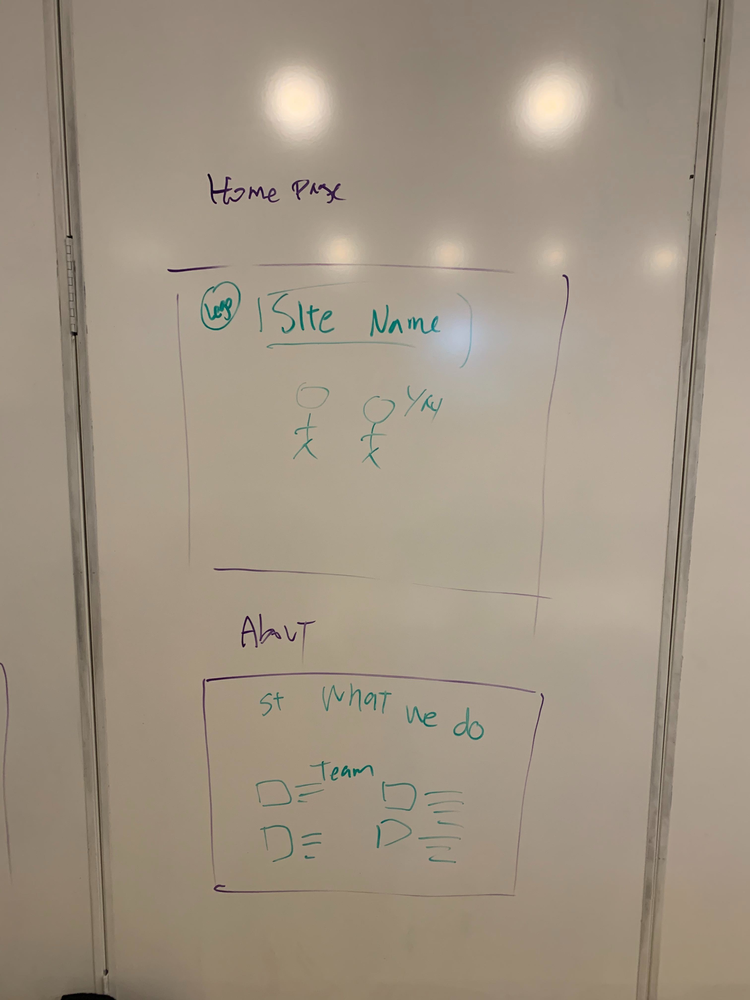
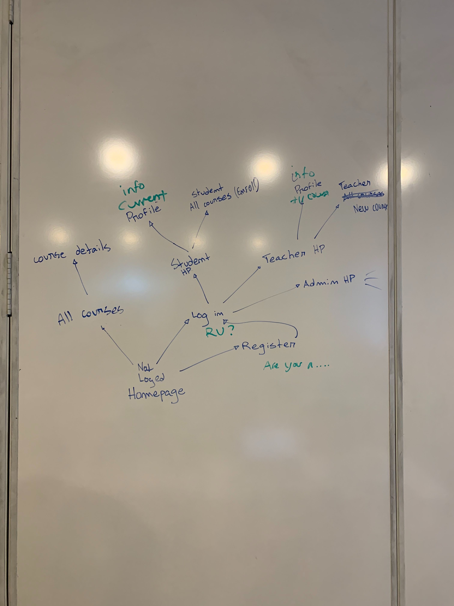
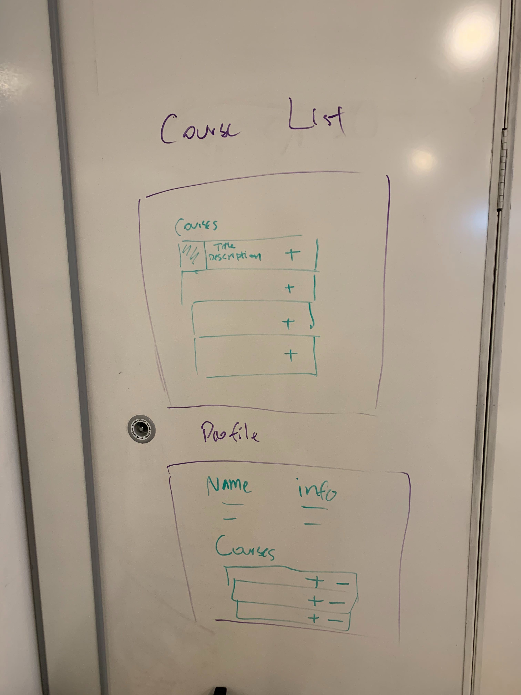
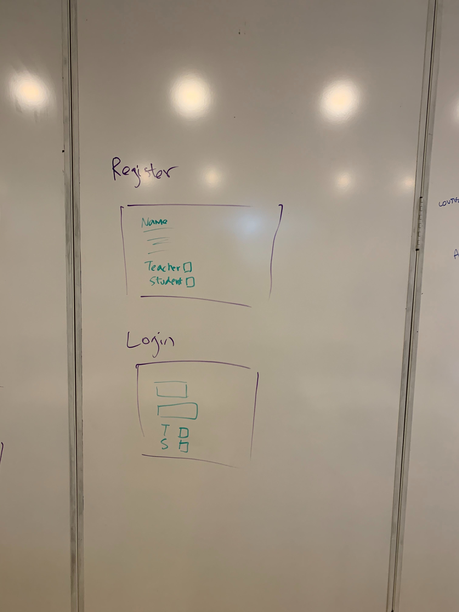
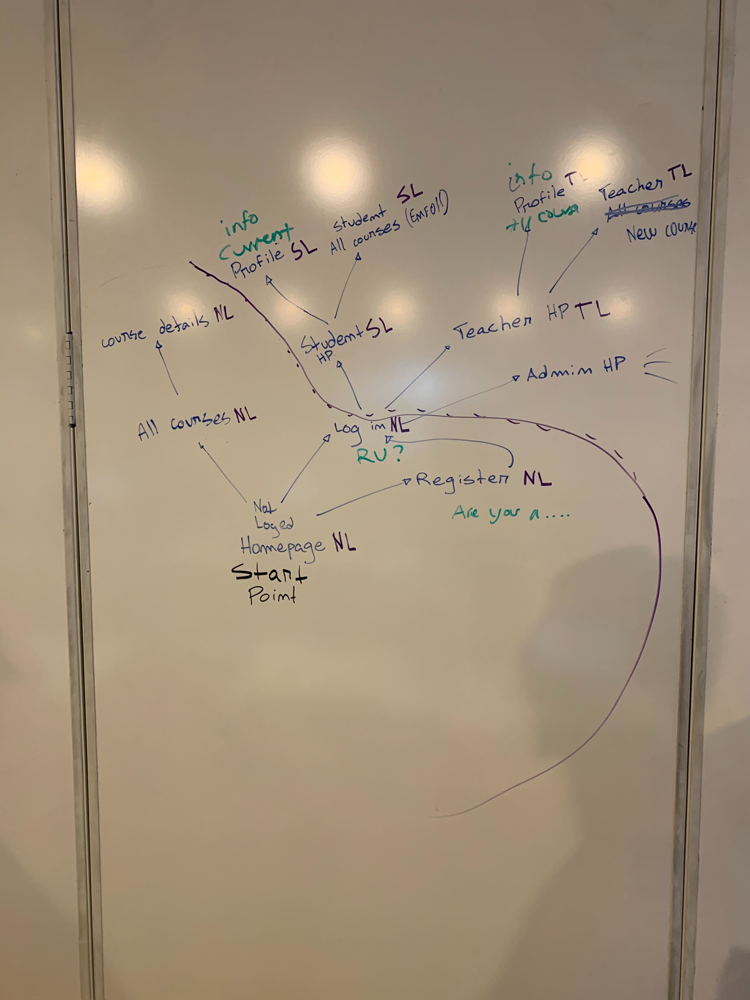
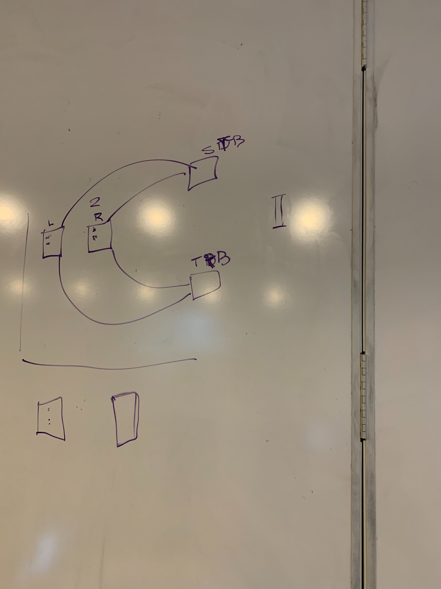
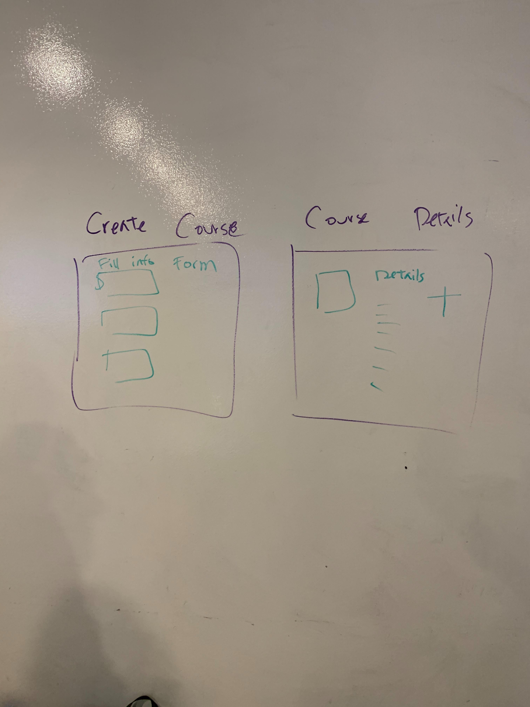

# academy-revolutionary-confederation

# Project 2 - academy-revolutionary-confederation

## Contents

* **[Overview](#overview):** What is this ARC(Academy-Revolution-Confederation)?
* **[Planning & Deliverables](#planning--deliverables):** What will we be turning in?
* **[Technical Requirements](#technical-requirements):** What technologies will we be using?
* **[Further Exploration](#further-exploration):** What if we want to do more?
* **[Deadlines](#deadlines):** When is it due?
* **[Submission](#submission):** How do we turn in the project?
* **[Project Groups](#project-groups):** Who are my group members and assigned instructor?
* **[Presentation Guidelines](#presentation-guidelines):** What should we cover during our presentation?
* **[Project Feedback](#project-feedback):** How will we get feedback from instructors?

---

## Overview

###### What is this ARC(Academy-Revolution-Confederation)?

We are the here to help students get with simple and manageable courses/lessons. By looking through our course list and making quick purchases. You will have access to all the course's and contents to get you to where you want to go.

**Our Wire Frame:**

**You will be working in groups of 4 for this project.**

---

## Planning & Deliverables

###### What will we be turning in?

### Project Planning Deliverables

**You must review the following with your instructional team BEFORE you start to code.**

* **Scope:** What are you planning to build? What do you reasonably think you can implement in the time period?
* **User Stories:** Who is your user? What features will your app have? Set up your project and user stories in <a href="https://trello.com" target="_blank">Trello</a> or in some other organized format.
* **Wireframes:** Sketch out what your core pages will look like and how they will work. Consider making a *paper prototype* to demonstrate and/or test key user interactions.
* **Data Models:** Draw out the models and any associations for your project in an entity relationship diagram (ERD).
* **Milestones:** Outline the milestones/sprints for your group.
* **Delegating Tasks:** What will each group member work on? Leverage everyone's strengths, and spend the majority of coding time pair programming.

### Completed Project Deliverables

* Link to Heroku hosted project, with all core technical requirements and three flexible technical requirements complete.
* Link to source code on GitHub.
* A `README.md` file with the following:
  * Description: Short paragraph (2-3 sentences) "elevator pitch" describing what your project does
  * Wireframes and user stories
  * Link to Heroku hosted project
  * Technologies (languages, external libraries, APIs)
  * Wish List / Future Development
  * Contributors (with links to their GitHub profiles)

---